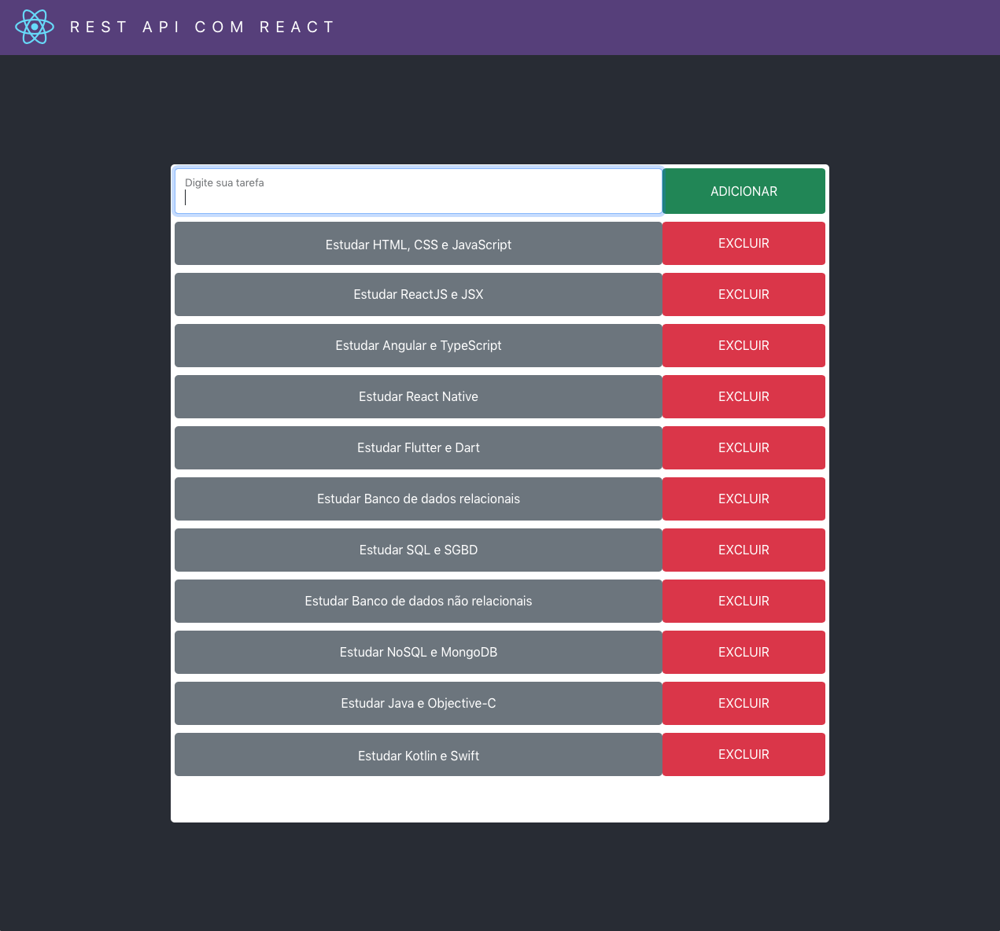
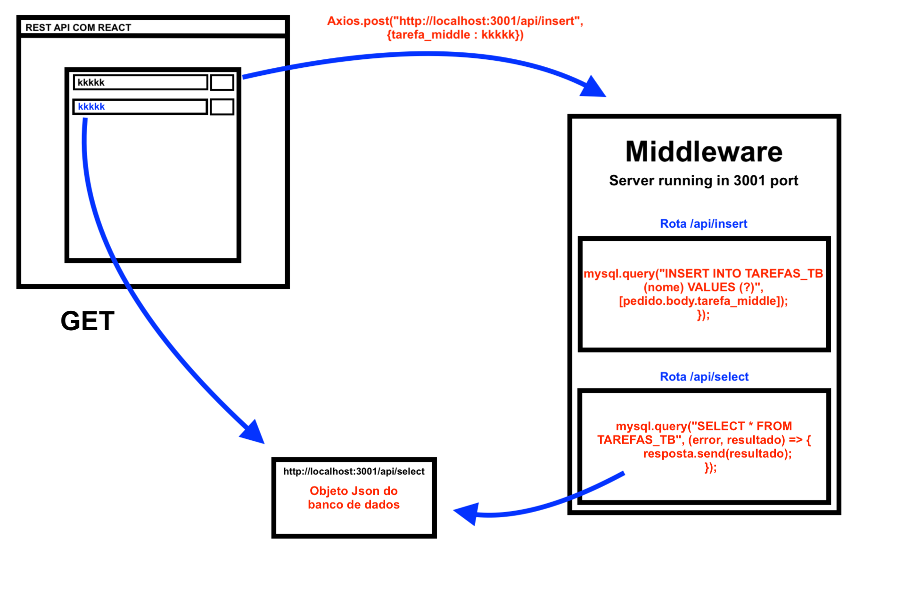

#### Aplicação React conectada com banco de dados MySQL que adiciona e remove tarefas.




1 - Inicia a aplicação React
```
cd todo-app
npm install
npm start
```

2 - Inicia o servidor
```
cd todo-server
npm install
node index.js
```

3 - Criação da tabela com SQL

```sql
CREATE DATABASE TODO_DB;

CREATE TABLE TAREFAS_TB (
    id int primary key auto_increment not null,
    nome varchar(90)
);
```

Instalação dos módulos usados no lado servidor

```
npm install express
npm install mysql
npm install body-parser
npm install cors
```

Instalação do módulo usado no lado cliente

```
npm install axios
